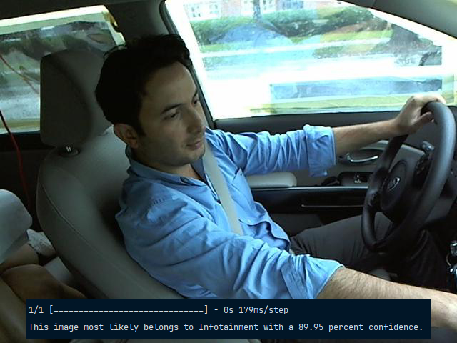
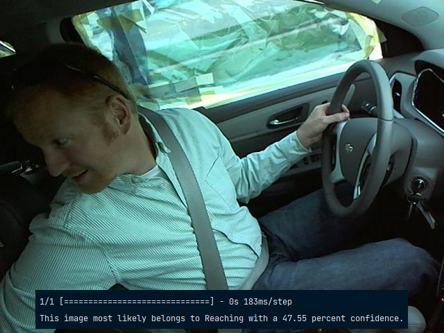
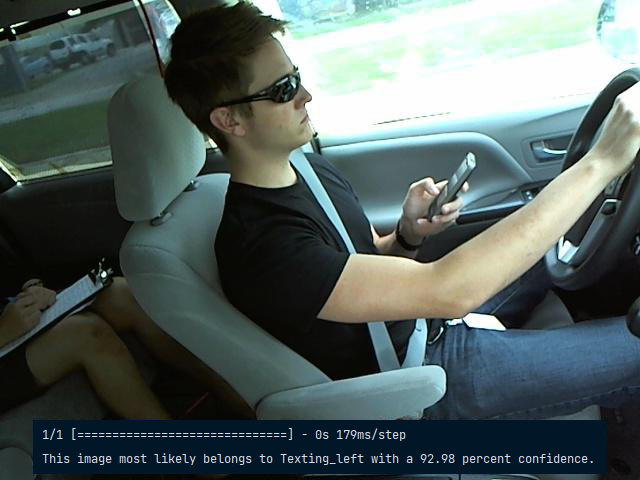
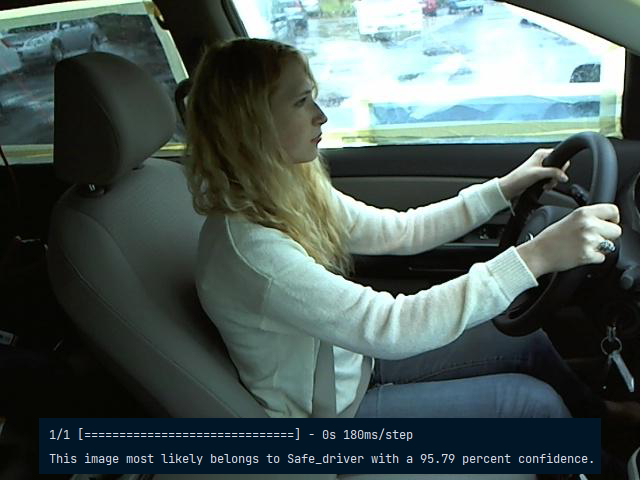
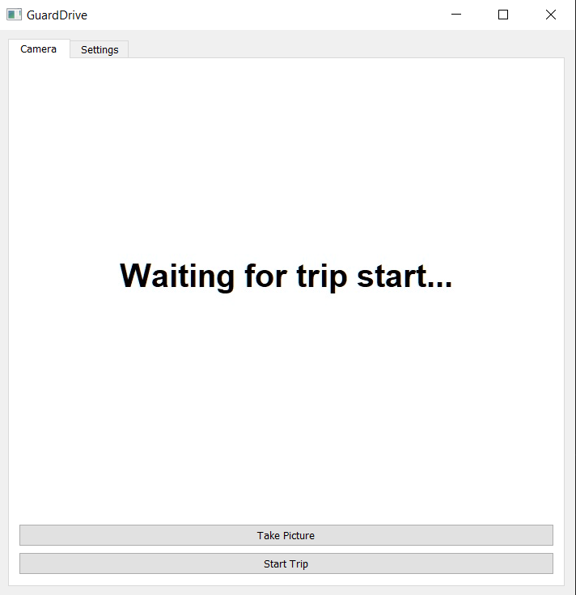

# GuardDrive
Developped during the QHACKS 2023 hackathon, **GuardDrive** is a project that utilizes computer vision and machine learning to detect and prevent distracted driving, making roads safer for all by reducing the risk of accidents caused by distractions.

## Table of contents
* [Inspiration](#inspiration)
* [Demo](#demo)
* [Functionality](#functionality)
* [Tech](#tech)
* [Challenges](#challenges)
* [Accomplishments](#accomplishments)
* [Learnings](#learnings)
* [Future](#future)

## Inspiration
According to the CDC motor vehicle safety division, **one in five car accidents** is caused by a distracted driver. Distracted driving is a serious issue that affects countless individuals and families every day, many of the accidents being fatal. Our team was driven by the desire to make a real impact in reducing the number of accidents caused by this dangerous behaviour. We were inspired to take on the challenge of **creating an accurate computer vision machine learning model** that could detect and deter distracted driving in **real-time**. We call our platform: **GuardDrive**.

## Demo
These images are from the test database, however, the demo was made to work on a computer webcam and would save a new image every few frames and give a prediction based upon that saved image. Because tests during the hackathon could not be completed in a car, the environmental queues were not detected by the model, and indications of possible overfitting became apparent.

|   |  |
| --------------------------------------- | --------------------------------------- |
|   |  |

## Functionality
Our model detects whether a driver is driving safely or is distracted at the wheel. There are 9 different distracted cases, which include texting while driving (right or left hand differentiation), reaching back, using the car's infotainment system, drinking, scratching, having one's head turned or being on a handheld phone call (with the right of left hand).

We used a computer's webcam to capture video simulating a driving experience as well as the different distracted driving cases. The program periodically saved images from the video and output its prediction to the console.

## Tech
Using the **Tensorflow** and **Keras** libraries, I built and refined my team's model and trained it on a massive dataset of over **100,000 images** provided by the State Farm insurance company, which, together, helped us to achieve a **tested accuracy of 96%**. The final implementation was built using **PyQT** for the GUI, which made it user-friendly and easy to use, although the GUI is **not intended to be customer facing** until a playback feature can be added.

## Challenges
The main challenge we encountered was recapturing test cases using the webcam from our laptops, which exposed us to the likely overfitting that happened with the large dataset used for training. Given that we did not recreate the testing environment in a car, the results given to to us were less accurate than the validation done with the test database.

## Accomplishments
Our solution has the potential to revolutionize the way insurance companies monitor and reward safe driving behaviour. It can also be used by trucking companies to ensure the safety of their drivers and protect their bottom line. Additionally, it can be used by parents to give them peace of mind when their children first start driving, or anyone interested in the benefits that come with monitored driving.

More over, we:
* Achieved a **tested accuracy of 96%** in detecting driver distractions.
* Built a **highly reliable** and **scalable** model, capable of handling a database of over 100,000 images, demonstrating the power of computer vision in solving real-world problems.
* Successfully integrated the model into a real-time application, **demonstrating its potential for use in commercial systems**.
* Demonstrated the effectiveness of computer vision in addressing a major problem in road safety and the potential to save lives by reducing the number of accidents caused by distracted driving.
* The model received **recognition and praise** from upper year mentors and volunteers during the hackathon.

## Learnings
* The importance of high quality data for training computer vision models.
* The challenge of detecting distraction in real-world driving scenarios.
* The potential for using computer vision to improve road safety.
* The effectiveness of transfer learning techniques in improving model accuracy.
* The limitations of current computer vision models in detecting subtle and diverse distraction behaviors.

## Future
What's next for GuardDrive? We could/hope to integrate video playback features so that interested parties can look back at flagged incidents to help better our users' driving practices and improve road safety for all.
